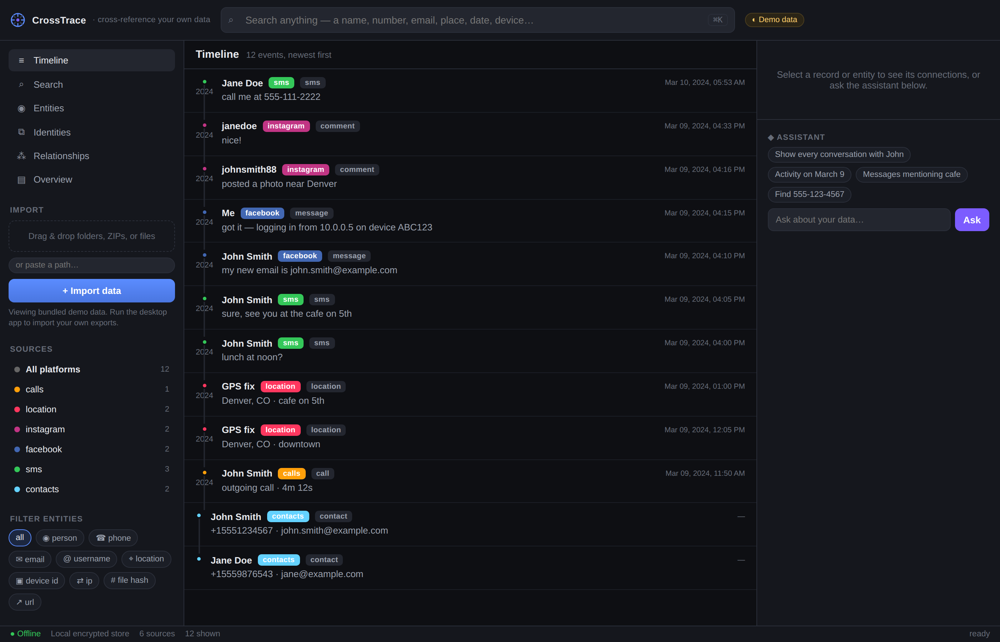

# CrossTrace

**Import once, normalize everything, correlate automatically.**

CrossTrace is an offline-first analytics desktop app that lets you import your
own exported data from many platforms and cross-reference it to reveal
timelines, relationships, recurring identifiers, and patterns — all in one
fast, searchable interface. Nothing leaves your machine.

> CrossTrace is designed for exploring **your own** exported data (Facebook,
> Instagram, SMS backups, contacts, call logs, GPS history, and so on). It runs
> fully offline against a local store.



## What it does

- **Import** folders, files, or ZIPs (read in place, no extraction). Platform
  and file type are auto-detected.
- **Normalize** every source into one local SQLite store with full-text search.
- **Extract** identifiers — people, phone numbers, emails, usernames, device
  IDs, IPs, locations, file hashes — and de-duplicate them into entities.
- **Correlate** automatically: records that share an entity are linked, and
  entities that co-occur are clustered into inferred identities.
- **Explore** through a three-pane dark UI: a chronological cross-platform
  timeline, universal Google-like search, an entity list by frequency, a
  relationship graph, and an import overview with charts and an activity
  heatmap.
- **Ask** a built-in assistant natural-language questions; it translates them
  into queries over your data and **cites the exact records** — it never
  invents information.

## Architecture

CrossTrace is split so the engine can be tested in isolation from the GUI:

| Layer | Path | Role |
|-------|------|------|
| **Core engine** | [`core/`](core) | Pure Rust. Ingest, parsing, entity extraction, storage, search, correlation, clustering, stats. No GUI deps — fully unit-tested. |
| **Desktop shell** | [`src-tauri/`](src-tauri) | Thin Tauri (v2) layer exposing the core over IPC commands. |
| **Frontend** | [`frontend/`](frontend) | React + TypeScript + Vite three-pane UI. |
| **CLI** | [`core/src/bin/crosstrace.rs`](core/src/bin/crosstrace.rs) | A command-line front end over the same engine (runs without the GUI). |

See [`docs/architecture.md`](docs/architecture.md) for the data model and the
correlation strategy.

## Quick start

### Run the engine from the command line

```bash
cd core
cargo run --bin crosstrace -- crosstrace.db import /path/to/your/exports
cargo run --bin crosstrace -- crosstrace.db search "555-123-4567"
cargo run --bin crosstrace -- crosstrace.db timeline
cargo run --bin crosstrace -- crosstrace.db clusters
cargo run --bin crosstrace -- crosstrace.db stats
```

### Run the tests

```bash
cd core && cargo test
```

### Run the desktop app

Requires the [Tauri v2 prerequisites](https://v2.tauri.app/start/prerequisites/)
(a C toolchain and, on Linux, `webkit2gtk`).

```bash
cd frontend && npm install
cd ../src-tauri && cargo tauri dev      # or: npm --prefix ../frontend run tauri dev
```

### Preview the UI in a browser (no backend)

The frontend ships with a small bundled demo dataset and an in-browser engine,
so you can explore the interface without building the desktop shell:

```bash
cd frontend && npm install && npm run dev
```

## Supported formats (MVP)

CSV / TSV · JSON (generic + Facebook/Instagram message exports) · vCard (`.vcf`)
contacts · SMS Backup & Restore XML · ZIP archives of any of the above.

The parser layer is a plugin surface — new formats implement one function and
register in the ingest dispatcher (see the architecture doc).

## Privacy

- Offline by default; no network calls.
- Local store under your OS app-data directory.
- Every processing step is written to an append-only audit log.

## License

MIT
